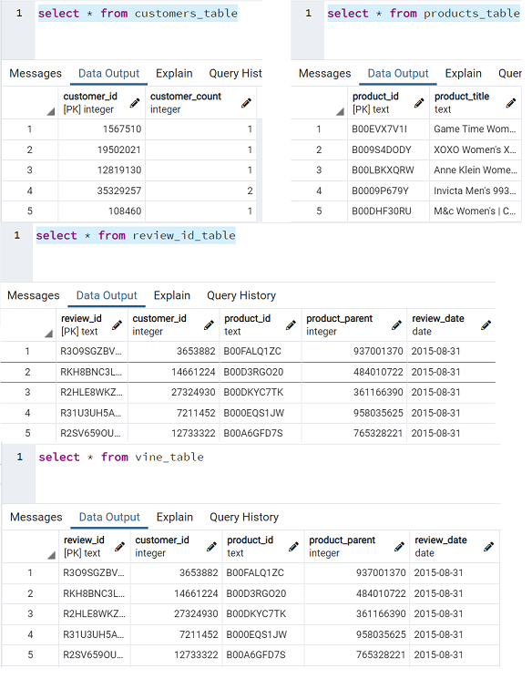
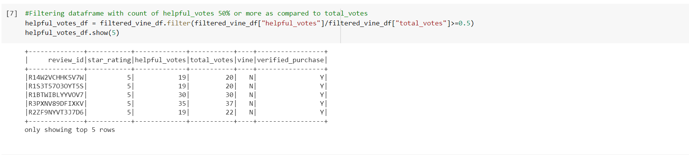
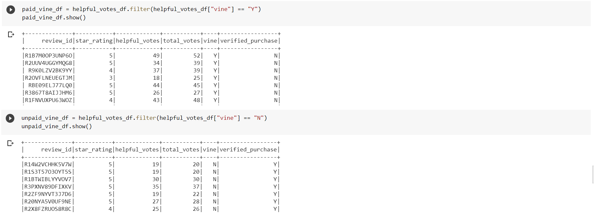
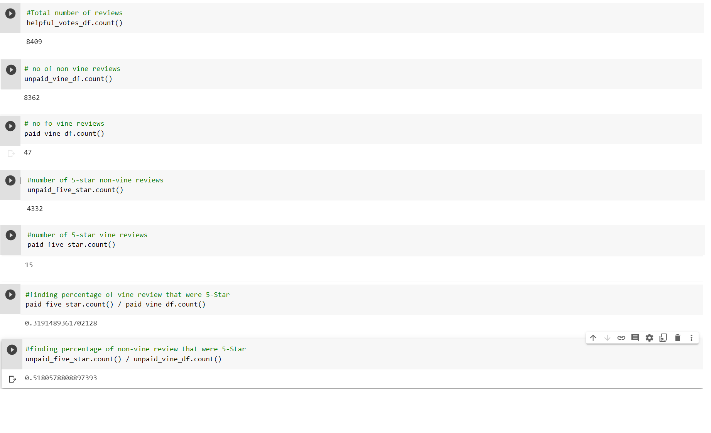

# Amazon Vine Analysis

## Overview 

The project is to analyse Amazon reviews written by members of paid Amazon vine program. Dataset for watches is analysed using PySpark through ETL procedure while storing data in AWS and further analysing data for any possible bias towards favourable reviews from vine members.

## Purpose

The purpose of this analysis is to analyse Amazon reviews for watches and identify if there is any bias present in providing reviews using tool like PySpark, AWS and Postgres Sql . 

## Results

Fig # 16.1 Transformed dataframes in SQL tables

To determine bias in reviews given by vine members as compared to non-vine members, the vine_dataframe is filtered on multiple conditions to make it more sensible for the analysis. 

Fig # 16.2 Filtered vine_dataframe with given conditions

Finally, table is divided into vine and non-vine review tables as follows:

Fig # 16.3 vine member and non-vine members review tables

Analysing the reviews provide insights as below:

Fig # 16.1 Key results of the analysis

Number of vine reviews:	8409

Number of non-vine reviews:	8362

Number of vine reviews:	47

Number of 5-star vine reviews:	15

Number of 5-star non-vine reviews:	4332  

Percentage of 5-star vine reviews:	32%

Percentage of 5-star non-vine reviews:	52%

## Summary

On analysing final results of the analysis, it shows that there is no positivity bias in reviewing watches as the percentage of 5-Star reviews given by vine member is lesser when compared to non-vine members’ reviews. 

To check any bias in the review of watches by vine and non-vine members, I would have gone ahead and checked average ratings for both vine and non-vine members to check if there is any bias ness in giving overall ratings to the watches. 

